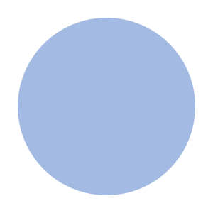

## Algebraic Graphs

Nicolas Audinet, RELEX

February 2019

+++

Some fancy set unicode shenanigans:

&#120141; this is a cool V

&#120124; this is a cool E

&#120126;

&#8712;
&#x2208;
∈

∅
&#x2205;

⊆
&#x2286;

×
&#x00d7;

---

## Graph Basics

+++

A graph &#120126; ( &#120141;, &#120124; ) is a pairing of:
* a set of vertices &#120141;
* a set of edges &#120124; ⊆ ( &#120141; × &#120141; )

+++

In Haskell:

```haskell
data G a = G
  { vertices :: [a]
  , edges    :: [(a,a)]
  }
```

+++

The Problem:

You can represent things that are not graphs

e.g. G [1] [(1,2)]

---

```haskell
data Graph a
  = Empty
  | Vertex a
  | Overlay (Graph a) (Graph a)
  | Connect (Graph a) (Graph a)
```

+++

Empty


