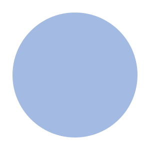
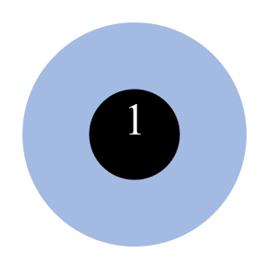
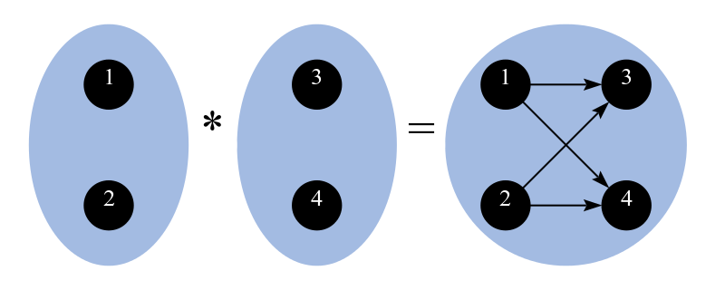
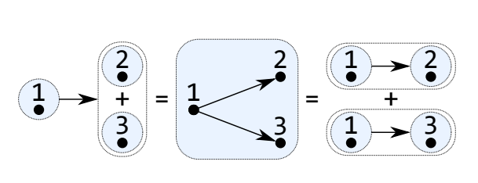
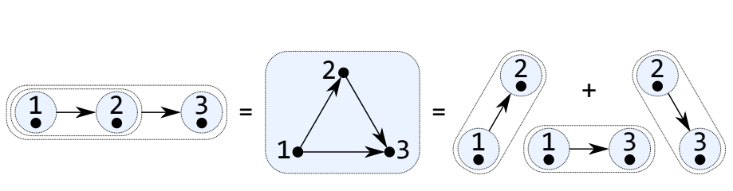

## Algebraic Graphs

Nicolas Audinet, RELEX

February 2019

+++

* All the concepts and code from this presentation
are taken from Andrey Mokhov's paper
**Algebraic Graphs with Class**(https://bit.ly/2Gxnn1G)

* **algebraic-graphs** on Hackage

---

## What is a graph?

A graph &#120126; ( *V*, *E* ) is a pairing of:
* a set of vertices *V* &#x2286; &#120141;
* a set of edges *E* ⊆ ( *V* × *V* )

where &#120141; is the set of all possible vertices

+++

In Haskell:

```haskell
data G a = G
  { vertices :: [a]
  , edges    :: [(a,a)]
  }
```

+++

The Problem:

You can represent things that are not graphs!

e.g. G [1] [(1,2)]

since *E* &#x2286; (&#120141; × &#120141;)

---

## Algebraic Graphs

```haskell
data Graph a
  = Empty
  | Vertex a
  | Overlay (Graph a) (Graph a)
  | Connect (Graph a) (Graph a)
```

> labelled vertices and unlabelled edges

+++

**Empty**

&#x03b5; = (&#x2205;, &#x2205;)



+++

**Vertex *v***

( {*v*}, &#x2205;) where *v* &#x2208; &#120141;



+++

**Overlay g g**

(*V*<sub>1</sub> , *E*<sub>1</sub> ) + (*V*<sub>2</sub> , *E*<sub>2</sub> ) = (*V*<sub>1</sub> &#x222a; *V*<sub>2</sub> , *E*<sub>1</sub> &#x222a; *E*<sub>2</sub> )


+++

**Connect g g**

(*V*<sub>1</sub> , *E*<sub>1</sub> ) \* (*V*<sub>2</sub> , *E*<sub>2</sub> ) = (*V*<sub>1</sub> &#x222a; *V*<sub>2</sub> , *E*<sub>1</sub> &#x222a; *E*<sub>2</sub> &#x222a; ( *V*<sub>1</sub> × *V*<sub>2</sub>))



---

## Axioms

+++

**\+ is commutative and associative**

x + y = y + x

x + (y + z) = (x + y) + z

+++

**(G , \* , &#x03b5;) is a monoid**

x \* &#x03b5; = x

&#x03b5; \* x = x

x \* (y \* z) = (x \* y) \* z

+++

**\* distributes over +**

x \* (y + z) = (x \* y) + (x \* z)

(x + y) \* z = (x \* z) + (y \* z)



+++

**Decomposition**

x \* y \* z = (x \* y) + (x \* z) + (y \* z)



---

## Soundness

+++

**Absorption theorem**

(x \* y) + x + y = x \* y

+++

Proof using decomposition:

x \* y

= x \* y \* &#x03b5;

= x \* y + x \* &#x03b5; + y \* &#x03b5;

= x \* y + x + y

+++

> *edges are inseparable from their vertices*

Therefore we cannot construct an incorrect graph.

**proof of soundness**  

---

## The Typeclass

```haskell
class Graph g where
  type Vertex g
  empty   :: g
  vertex  :: Vertex g -> g
  overlay :: g -> g -> g
  connect :: g -> g -> g
```

+++

```haskell
edge :: Graph g => Vertex g -> Vertex g -> g
edge x y = connect (vertex x) (vertex y)

vertices :: Graph g => [Vertex g] -> g
vertices = foldr overlay empty . map vertex

edges :: Graph g => [(Vertex g, Vertex g)] -> g
edges = foldr overlay empty . map (uncurry edge)

graph :: Graph g => [Vertex g] -> [(Vertex g, Vertex g)] -> g
graph vs es = overlay (vertices vs) (edges vs)
```

**proof of completeness**

---

## Subgraph

If **x + y = y** then x is a subgraph of y

+++

x + y = y

(*V*<sub>x</sub>, *E*<sub>x</sub>) + (*V*<sub>y</sub>, *E*<sub>y</sub>) = (*V*<sub>y</sub>, *E*<sub>y</sub>)

therefore

*V*<sub>x</sub> &#x222a; *V*<sub>y</sub> = *V*<sub>y</sub>   ⇒   *V*<sub>x</sub> &#x2286; *V*<sub>y</sub>

*E*<sub>x</sub> &#x222a; *E*<sub>y</sub> = *E*<sub>y</sub>   ⇒   *E*<sub>x</sub> &#x2286; *E*<sub>y</sub>

+++

```haskell
isSubgraphOf :: (Graph g, Eq g) => g -> g -> Bool
isSubgraphOf x y = overlay x y == y
```

---

## Equality

+++

A binary relation

```haskell
data Relation a = R
  { domain   :: Set a
  , relation :: Set (a,a)
  } deriving Eq
```

+++

```haskell
import           Data.Set
import qualified Data.Set as S (empty)

instance Ord a => Graph (Relation a) where
  type Vertex (Relation a) = a
  empty = R S.empty S.empty
  vertex x = R (singleton x) S.empty
  overlay x y = R vs es
    where vs = domain x `union` domain y
          es = relation x `union` relation y
  connect x y = R vs es
    where vs = domain x `union` domain y
          es = relation x `union` relation y `union`
                  (domain x `setProduct` domain y)
```

+++

This representation is unique!
Can be used to test for equality.

+++

Converting the Graph data type

```haskell
fold :: Graph g => Graph ( Vertex g) -> g
fold Empty         = empty
fold (Vertex x   ) = vertex x
fold (Overlay x y) = overlay (fold x) (fold y)
fold (Connect x y) = connect (fold x) (fold y)
```

+++

Equality

```haskell
instance Ord a => Eq (Graph a) where
  x == y = fold x == (fold y :: Relation a)
```

---

## Undirected Graphs

Let Connect be commutative:

x \* y = y \* x

+++

*symmetric closure* of the binary relation

```haskell
data Symmetric a = S (Relation a)
  deriving (Graph, Num)

instance Ord a => Eq (Symmetric a) where
  S x == S y = symmetricClosure x == symmetricClosure y
```

---

## Reflexive Graphs

Add the *self-loop* axiom:

v = v \* v where v &#x2208; &#120141;

---

## Transitive Graphs

Add the *closure* axiom:

y /= &#x03b5; ⇒ x \* y + y \* z + x \* z = x \* y + y \* z

---

## Graph Transpose

```haskell
newtype Transpose g = T { transpose :: g }
  deriving Eq
```

+++

Zero cost: all the transposing is handled by GHC at compile time.

```haskell
instance Graph g => Transpose (Graph g) where
  type Vertex (Transpose g) = Vertex g
  empty   = T empty
  vertex  = T . vertex
  overlay = T $ overlay (transpose x) (transpose y)
  connect = T $ connect (transpose y) (transpose x)
```

---

## Graph Functor

```haskell
newtype GraphFunctor a =
  F { gfor :: forall g. Graph g => (a -> Vertex g) -> g }
```

+++

Pushes a function all the way to the leaves in a graph expression.

```haskell
instance Graph (GraphFunctor a) where
  type Vertex (GraphFunctor a) = a
  empty       = F $ \ _ -> empty
  vertex  x   = F $ \f -> vertex (f x)
  overlay x y = F $ \f -> overlay (gmap f x) (gmap f y)
  connect x y = F $ \f -> connect (gmap f x) (gmap f y)
```

+++

```haskell
gmap :: Graph g => (a -> Vertex g) -> GraphFunctor a -> g
gmap = flip gfor
```

Not exactly a functor because Graph is not a higher-kinded type

---

## Benchmarks

https://github.com/haskell-perf/graphs/tree/master/results

